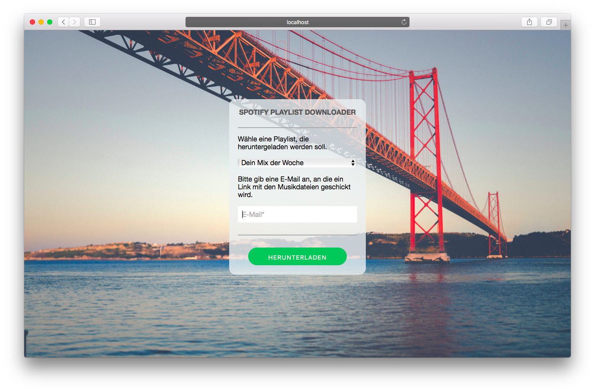

# spotandfly

### spotify-to-youtube-to-mp3 downloader

## web interface

*This is not included in this project. Please contact me if you want to use it.*

## why?

You have a playlist on Spotify and want to download it?  
You don't have Spotify Premium and want to hear your music ad-free and offline?  
No problem!

Use **spotandfly**!  

## what?

This program lets you download your Spotify playlists which get downloaded from YouTube and converted to mp3 files.

## first setup

1. Go to [https://developer.spotify.com/my-applications](https://developer.spotify.com/my-applications), login and create a new application (add `http://localhost` to *Redirect URIs* and save)
2. Copy *Client ID* and *Client Secret* into `spotandfly.py`
3. Go to [https://console.developers.google.com](https://console.developers.google.com), create a new project, go to its API dashboard, click "Activate API", add the YouTube Data API and get an API key
4. Copy the API key for YouTube you've created into `spotandfly.py` (`DEVELOPER_KEY`)

And in the shell

    $ virtualenv env && source env/bin/activate
    $ pip install -r requirements.txt
    $ pip install git+https://github.com/plamere/spotipy.git

Install `ffmpeg` (required for conversion)

    # for debian/ubuntu
    $ sudo apt-get install ffmpeg
    # for mac osx
    $ brew install ffmpeg

## usage

    $ python spotandfly.py username playlistname outputfolder
    # it'll open a window with 'http://localhost?code=...',
    # copy and paste the link into the program
    # ...
    # enjoy your music!

## etc

tested with python 2.7.10 and 3.7.1 on macSierra.  

dependencies:

- spotipy
- youtube-dl
- google-api-python-client, oauth2client
